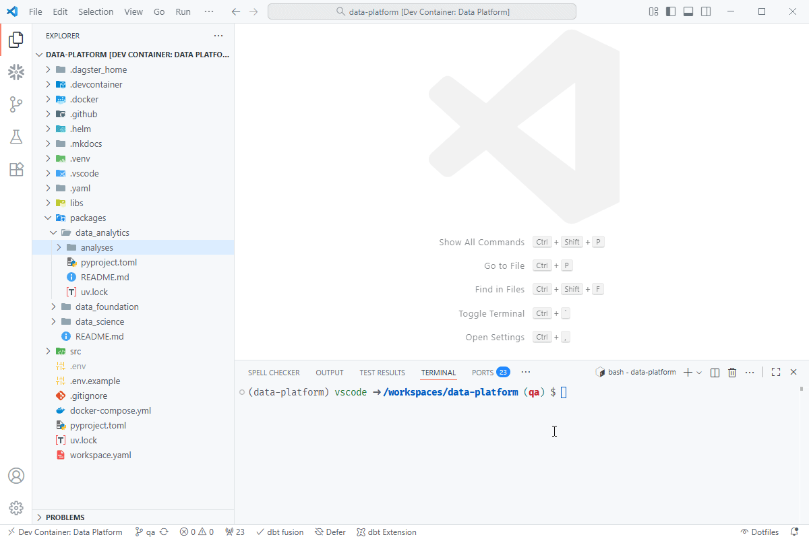
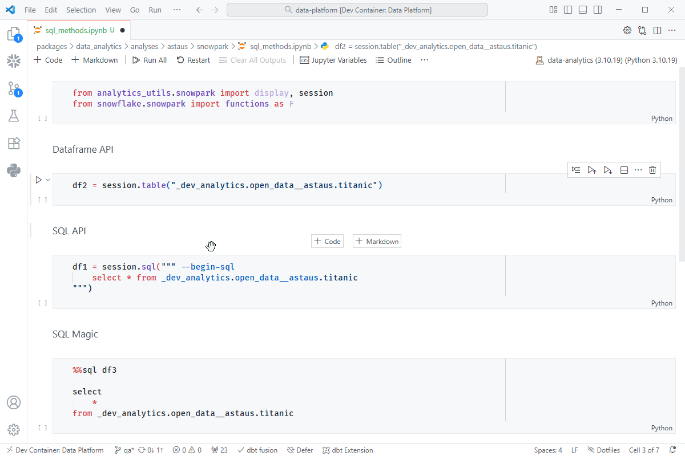
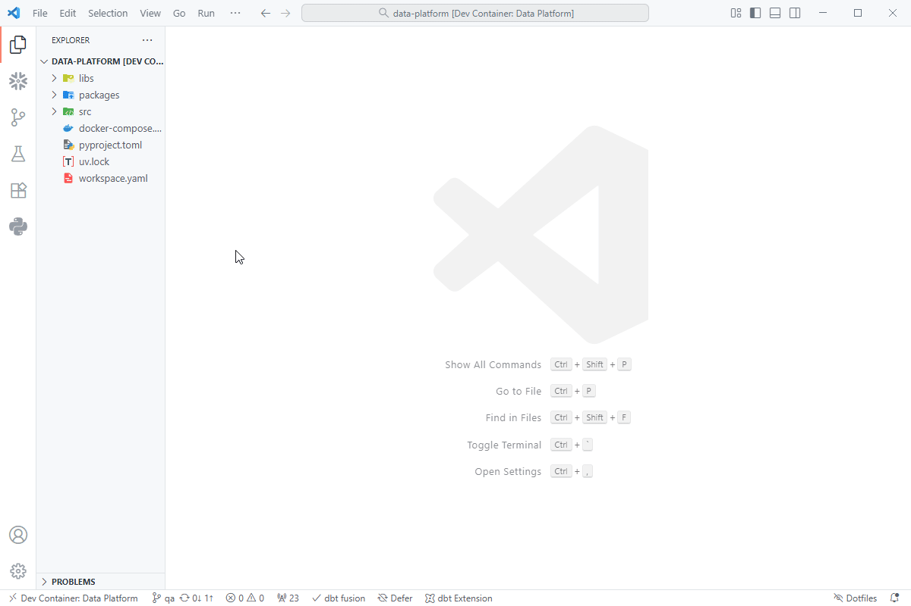
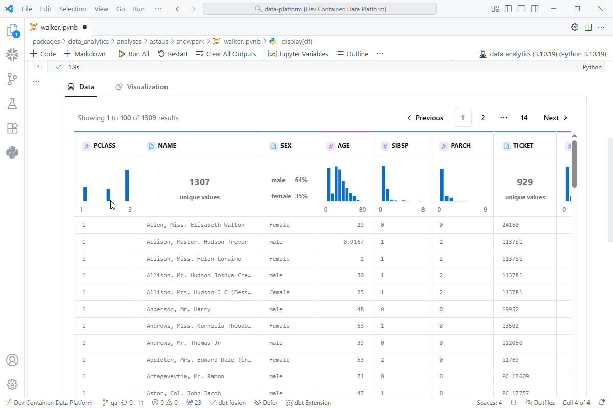

# Quick Start

Follow these steps to quickly set up and start using your **Analytics workspace** for interactive Snowpark exploration.

---

## 1. Install Packages

Analytics uses a different python environment than the rest of the platform.
To install the packages, open a terminal and navigate to the `data_analytics` folder:

``` bash
cd packages/data_analytics/
```

Then install the packages by running:

``` bash
uv sync
```

???+ quote "Install Packages"
    { align=left }

    !!! tip "Best Practice"
        Deactivate your current shell before installing the packages by entering the
        `deactivate` command.

---

## 2. Connect to Snowflake
??? example Session

    ```python
    from analytics_utils.snowpark import session
    ```

Once your environment is ready, you can connect directly to **Snowflake via Snowpark** using
the built-in `session` helper.

This automatically:
- Loads your Snowflake credentials from `.env`
- Connects to your assigned database, schema, role, and warehouse
- Prints the current session info for confirmation


## 3. Query Methods

There are several methods that can be used to query data:

??? tip "Dataframe API"

    ```python
    session.table("raw.public.customers")
    ```

??? tip "SQL API"

    ```python
    session.sql("select * from raw.public.customers")
    ```

??? tip "SQL Magic"

    ```sql
    %%sql
    
    select
        *
    from raw.public.customers
    ```

All are equivalent and valid as they are compiled and run on the snowflake warehouse.

???+ quote "Query Methods"
    { align=left }

---

## 4. Using Display

??? example Display

    ```python
    from analytics_utils.snowpark import display
    ```

The `display()` function overrides the default jupyter notebook behavior with a
powerful tool to explore the data.  It is optimized to work with Snowpark dataframes
and ensures a seamless experience for users.

???+ quote "Display Table"
    { align=left }

---

## 5. Display Visualization

Beyond tabular display, display() also supports rich visualizations similar to Tableau — directly in your notebook.
You can drag-and-drop fields to create charts, pivot tables, and explore trends.

???+ quote "Display Visualization"
    { align=left }

