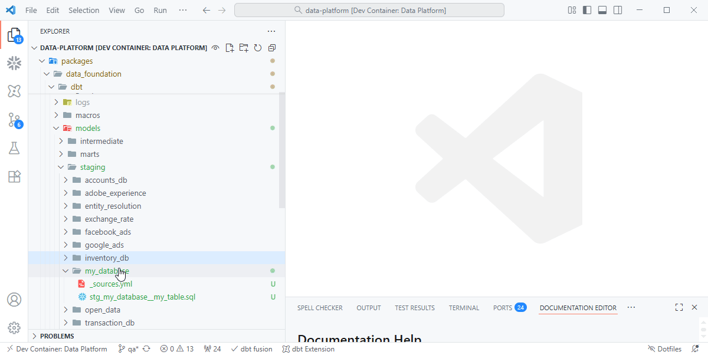

# Quick Start

This guide walks through how to extend the existing **dbt project** integrated with **Dagster**.  
All **raw data** from Sling and dltHub is already available in the `raw` database.  
You’ll add new **staging**, **intermediate**, and **mart** models that transform this data for analytics.

---

## 1. Create a Staging Model

Staging models standardize and clean source data from the `raw` schema.  
Each staging folder corresponds to a source system (e.g., `accounts_db`, `facebook_ads`, `transaction_db`).

Navigate to:

```
models/staging/<source_system>/
```

Create a new SQL file named with the convention:  
`stg_<source_system>__<table_name>.sql`

???+ quote "Creating Staging Models"
    { align=left }

??? example "stg_accounts_db__accounts.sql"
    `models/staging/accounts_db/stg_accounts_db__accounts.sql`

    ```sql
    with source as (
        select * from {{ source("accounts_db", "accounts") }}
    ),

    renamed as (
        select
            id::int               account_id,
            name::varchar(50)     account_name,
            created_at::timestamp created_at
        from source
    )

    select * from renamed
    ```

**Best Practices**
- Use `snake_case` for column names.  
- Explicitly cast data types.  
- Prefix staging models with `stg_` and separate schema and table with double underscores (`__`).

---

## 2. Define the Source

Each source system should have a `_sources.yml` file inside its staging folder.  
This declares the raw tables ingested by Sling and dltHub so dbt can reference them with the `source()` function.

???+ quote "Defining Sources"
    { align=left }

??? example "models/staging/accounts_db/_sources.yml"

    ```yaml
    version: 2

    sources:
    - name: accounts_db
        description: "Landing zone for accounts_db"
        database: "{{ '_'+target.name+'_' if not target.name == ('prod') -}} raw"
        schema: accounts_db {{- '__'+target.user if not target.name == ('prod') }}
        tables:
        - name: accounts
            description: "Accounts data extracted from the source system"
    ```

    !!! tip
        Each source system should have its own `_sources.yml` file.  
        For example:
        ```
        staging/
        ├── accounts_db/_sources.yml
        ├── facebook_ads/_sources.yml
        ├── transaction_db/_sources.yml
        ```
---

## 3. Document and Test Staging Models

Add a companion `.yml` file for each staging model to define metadata and tests.

???+ quote "Model Documentation"
    { align=left }

??? example "models/staging/accounts_db/stg_accounts_db__accounts.yml" 

    ```yaml
    version: 2

    models:
    - name: stg_accounts_db__accounts
        description: "Standardized accounts data cleaned from raw source"
        columns:
        - name: account_id
            description: "Unique identifier for the account"
            tests:
            - not_null
            - unique
        - name: account_name
            description: "Account display name"
        - name: created_at
            description: "Timestamp when the account was created"
    ```


**Common Tests:**

| Test | Description |
| ---- | ----------- |
| `unique` | Ensures the column contains distinct values. |
| `not_null` | Ensures the column is never null. |
| `relationships` | Validates joins between staging models. |

---

## 4. Create Intermediate Models

Intermediate models combine or enrich staging data before final marts.  
They typically live under `models/intermediate/` and are grouped by business domain (e.g., `marketing`, `finance`, `sales`).

???+ quote "Intermediate Models"
    { align=left }

??? example "models/intermediate/marketing/int_marketing__campaign_performance.sql"

    ```sql
    with campaigns as (
        select * from {{ ref('stg_facebook_ads__campaigns') }}
    ),
    performance as (
        select * from {{ ref('stg_facebook_ads__performance') }}
    )

    select
        c.campaign_id,
        c.campaign_name,
        p.impressions,
        p.clicks,
        p.spend
    from campaigns c
    join performance p on c.campaign_id = p.campaign_id
    ```

    !!! tip 
        Use the prefix `int_` to clearly identify intermediate models.  
        They are optional but useful for keeping marts clean and modular.

---

## 5. Create Mart Models

Mart models are the final layer — curated datasets for analytics, reporting, or dashboards.  
They live in `models/marts/` and are organized by domain (e.g., `marketing`, `finance`, `operations`).

???+ quote "Creating Mart Models"
    { align=left }

??? example "models/marts/marketing/fct_marketing__fct_attributions.sql"

    ```sql
    with campaign_data as (
        select * from {{ ref('int_marketing__campaign_performance') }}
    )

    select
        campaign_id,
        sum(spend) as total_spend,
        sum(clicks) as total_clicks,
        sum(impressions) as total_impressions
    from campaign_data
    group by 1
    ```

**Naming Conventions:**

| Prefix | Purpose |
| ------- | -------- |
| `stg_` | Raw → Cleaned data |
| `int_` | Intermediate joins and transformations |
| `dim_` | Dimension tables |
| `fct_` | Fact tables or aggregated datasets |

---

## 6. Build, Test, and Document

After adding your models:

```bash
dbt build
```

This command runs models, executes tests, and builds dependencies automatically.  
You can also generate and view documentation:

```bash
dbt docs generate
dbt docs serve
```

Dagster will automatically detect the new dbt assets and display them in the **Asset Graph**, showing full lineage:
```
Sling/dltHub → raw → staging → intermediate → marts
```

???+ quote "Dagster Integration"
    { align=left }

---

✅ **Summary**

| Step | Description |
| ---- | ------------ |
| **Staging** | Clean and standardize data from the raw schema. |
| **Sources** | Declare raw tables for use in dbt. |
| **Intermediate** | Join and enrich data across domains. |
| **Marts** | Build curated datasets for analytics. |
| **Build & Test** | Use `dbt build` to validate and materialize models. |
| **Observe in Dagster** | View the lineage graph from ingestion to marts. |

---
