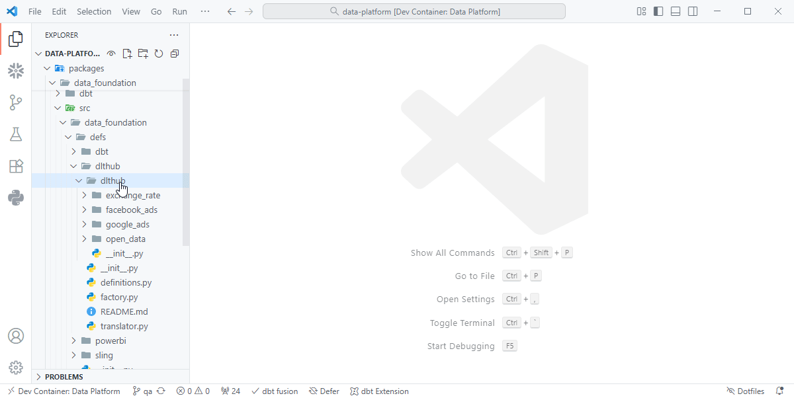
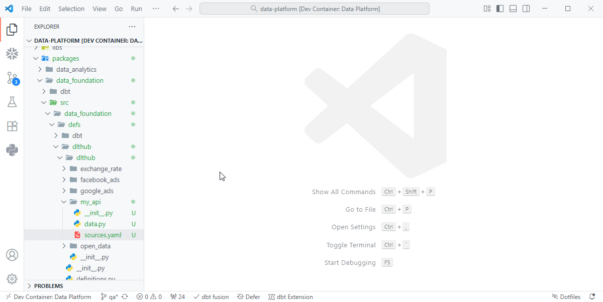
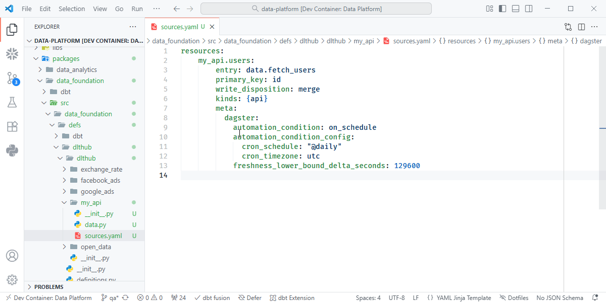

# Quick Start

Follow these steps to quickly set up and run your first **dltHub** configuration.

---

## 1. Create Configuration Files

Create a folder named after the dataset or API you’re connecting to.  
Inside that folder, create the following files:

- `__init__.py` — identifies the code as a Python module  
- `data.py` — defines a data generator function  
- `replication.yaml` — defines replication (extract & load) behavior

???+ quote "Creating Configuration Files"
    { align=left }

---

## 2. Create a Data Generator

In `data.py`, define a generator function that **yields batches of records**.  
Each `yield` returns a small batch of data for dltHub to load incrementally, allowing for **pagination and low memory overhead** during ingestion.

???+ quote "data.py"
    { align=left }

---

## 3. Configure Resources

The **resources** section defines one or more data generators (resources) that can be run and loaded by dltHub.  
Each resource points to a function defined in your `data.py`.

Press `Ctrl + Space` in VS Code to open IntelliSense and select **`dlt-resources`** to scaffold a resources template.

| Setting | Description |
| -------- | ----------- |
| `entry` | The import path of the function defined in `data.py`, e.g., `data.fetch_users`. |
| `write_disposition` | How data should be written to the destination (`append`, `merge`, `replace`). |
| `primary_key` | Column(s) used for identifying unique records when merging. |
| `args` / `kwargs` | *(Optional)* Additional parameters to pass to the generator function. |

???+ quote "Configure Resource"
    { align=left }

---

## 4. Configure Sources (*Optional*)

Sources group one or more resources under a logical namespace.  
They’re especially useful when combining related resources into a single extract.

Press `Ctrl + Space` and select **`dlt-sources`** to scaffold a sources template.


| Setting | Description |
| -------- | ----------- |
| `sources` | Defines a logical grouping of resources under one connector. |
| `resources` | A list of resource names to include in this source. |
| `meta` | Meta configuration for defining schedules and checks.  Source meta will override any settings in a resources. |

???+ quote "Configure Source"
    { align=left }

---

# Sources

??? example "sources.yaml"

    ```yaml
    sources:
        my_api:
            resources:
            - my_api.users
            - my_api.transactions
            meta:
                dagster:
                    automation_condition: on_schedule
                    automation_condition_config:
                        cron_schedule: "@daily"
                        cron_timezone: utc
                    freshness_lower_bound_delta_seconds: 108000
    ```

**Explanation:**
- The `sources` block declares a data source (e.g., an API, database, or file store).
- Each source can contain one or more **resources**, representing individual endpoints or tables.
- Grouping them provides modularity and reuse for replication definitions.

---

# Resources

??? example "sources.yaml"

    ```yaml
    resources:
        my_api.users:
            entry: data.fetch_users
            write_disposition: append
            primary_key: ["id"]
            kinds: {api}

        my_api.transactions:
            entry: data.fetch_transactions
            write_disposition: append
            primary_key: ["id"]
            kinds: {api}
    ```

**Explanation:**
- Each resource maps to a data generator function (defined in `data.py`).
- The resource defines how its data is written to the target system.
- Use multiple resources when extracting from different endpoints or datasets.

---

# Data Generator

The **data generator** defines *how* data is fetched.  
It can yield any iterable of dictionaries (records).  
dltHub automatically batches and streams data to the destination.

??? example "data.py Example"

    ```python
    import requests

    def fetch_transactions():
        """Fetch paginated transactions from API"""
        page = 1
        while True:
            response = requests.get(f"https://api.example.com/transactions?page={page}")
            data = response.json()
            if not data:
                break
            yield data
            page += 1
    ```

**Tips:**
- Always use **`yield`** (not `return`) to stream data in small chunks.  
- Use API pagination, cursors, or offsets to avoid loading too much data into memory.  
- Each yield should return a list (or iterable) of records, e.g. `[{...}, {...}, ...]`.

???+ quote "Yielding Data"
    { align=left }

---

✅ **Summary**

| Concept | Description |
| -------- | ------------ |
| **Data Generator** | Defines how data is fetched or produced in Python (`data.py`). |
| **Source** | Groups multiple resources under a single namespace (`sources.yaml`). |
| **Resource** | References a generator function and defines write behavior (`sources.yaml`). |

---
