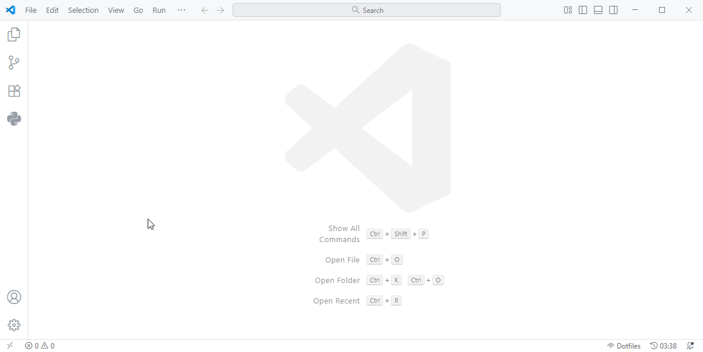
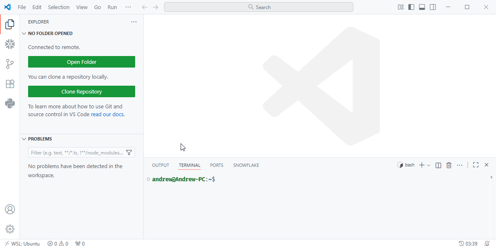
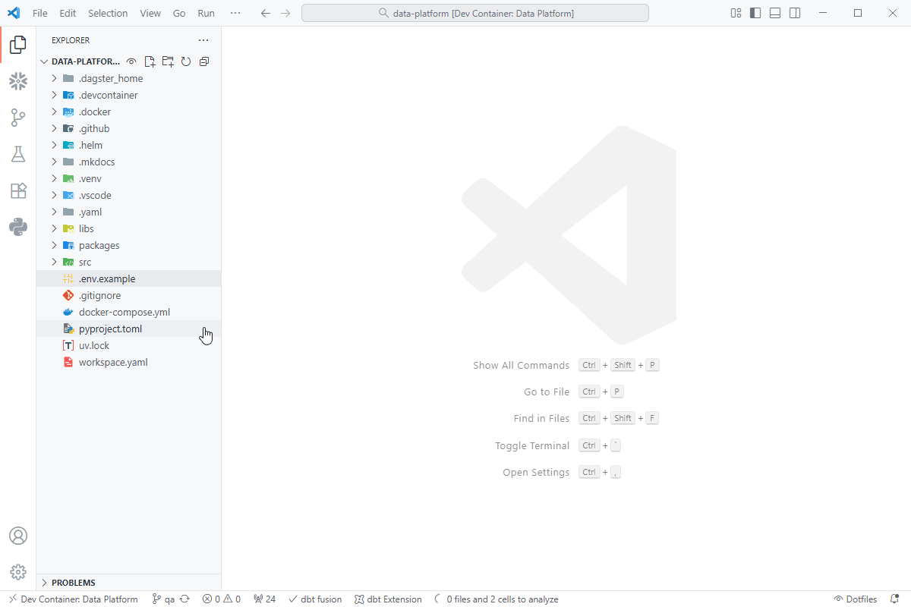
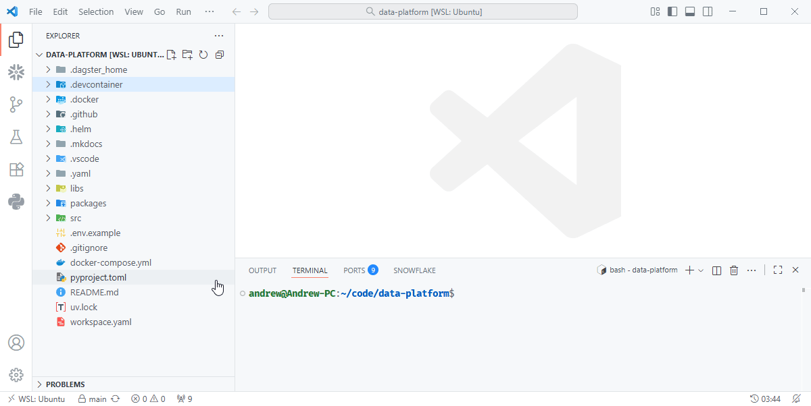
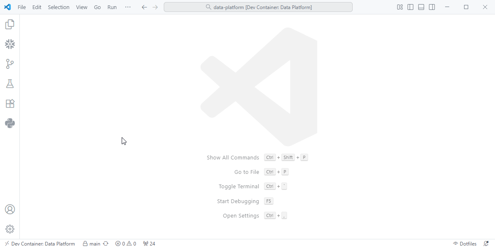
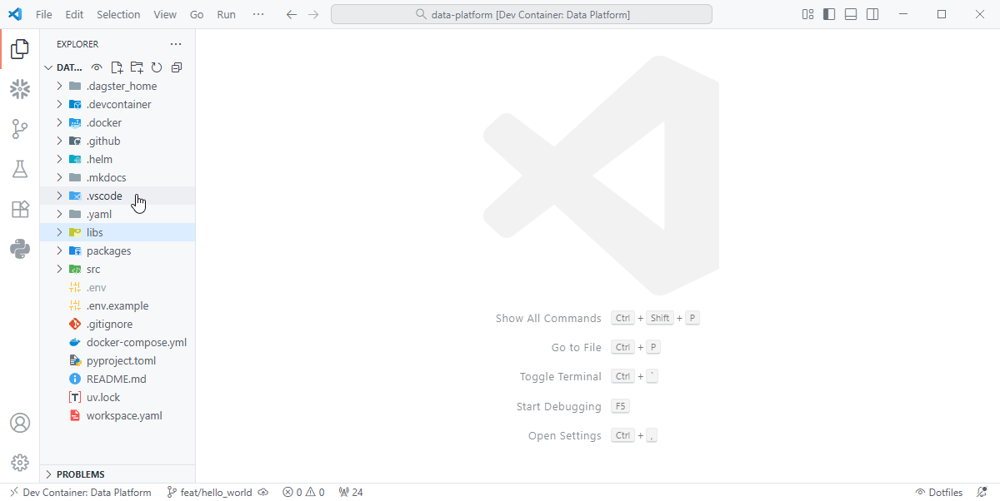
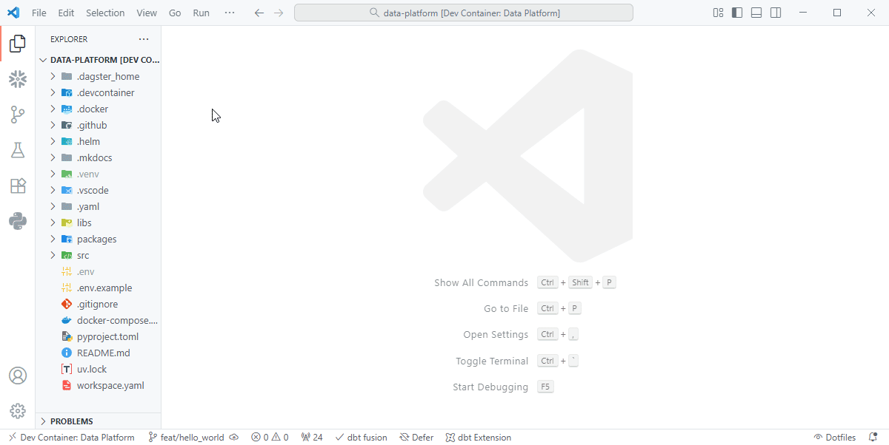

# Getting Started

## Setup

Follow these steps to set up your local development environment for the project.

---

### 1. Open VS Code

Launch **Visual Studio Code** and make sure it’s up to date.

---

### 2. Install Required Extensions

**Windows users:**

1. Install the [**WSL**](https://marketplace.visualstudio.com/items?itemName=ms-vscode-remote.remote-wsl) extension.  
2. Press `Ctrl + Shift + P`, then run **`>WSL: Connect to WSL`**.
???+ quote "WSL: Connect to WSL"
    { align=left }

**All users:**

Install the [**Dev Containers**](https://marketplace.visualstudio.com/items?itemName=ms-vscode-remote.remote-containers) extension.


---


### 3. Clone the Repository

**“Clone Repository”** to download the project to your **Linux filesystem** (this provides much better performance inside WSL).

???+ quote "Cloning the Repository"
    { align=left }

---

### 4. Configure Environment Variables

Copy the example environment file and update your credentials:

```bash
cp .env.example .env
```

Edit `.env` and fill in your local development secrets (e.g., API keys, database credentials).

???+ quote "Environment Setup"
    { align=left }

---

### 5. Open the Project in a Dev Container

From VS Code, press `Ctrl + Shift + P` and run:

```
> Dev Containers: Open in Container
```

If prompted, install **Docker for WSL** (free community edition).  
This launches your project in an isolated development container with preconfigured dependencies.

???+ quote "Dev Container Setup"
    { align=left }

---

### 6. Create a Feature Branch

Create a feature branch based off the QA branch.

???+ quote "Feature Branch"
    { align=left }

---

### 7. Sync Dependencies

Once the container is running, open the integrated terminal and run:

```bash
uv sync --all-packages
```

This command installs and synchronizes all project dependencies.

???+ quote "Syncing Dependencies"
    { align=left }

---

**Note:**  
Windows users must have **Windows Subsystem for Linux (WSL)** installed with at least one Linux distribution configured.  
You can verify WSL installation with:

```bash
wsl --list --verbose
```

---

## Usage

Once your container environment is up and running, you’re ready to develop.

---

### Dagster

For local development, the dagster dev command can now be used to preview and test
the changes you make in the code base.

```bash
dagster dev
```

???+ quote "Dagster Dev"
    { align=left }

---

### Running dbt

- **dbt** and its extensions are automatically installed inside the container.  
  You can execute dbt models directly from VS Code using the built-in terminal.

---

### Running Snowflake Scripts

The **Snowflake extension** is also preinstalled.  
You can use it to run non-dbt SQL scripts directly from VS Code.

---

### Managing Local Environments

Libraries and packages under `libs/` and `packages/data_analytics/` do **not** install automatically.  
For best results, run the following inside each subproject directory:

```bash
uv sync
```

This creates and syncs isolated virtual environments for each workspace.

---

✅ **Summary**
- Use **WSL** and **Dev Containers** for a consistent local setup.  
- Run **`uv sync --all-packages`** after launching your container.  
- dbt-Fusion and Snowflake are ready out of the box.  
- Run **`uv sync`** inside each subproject for smoother development.

---