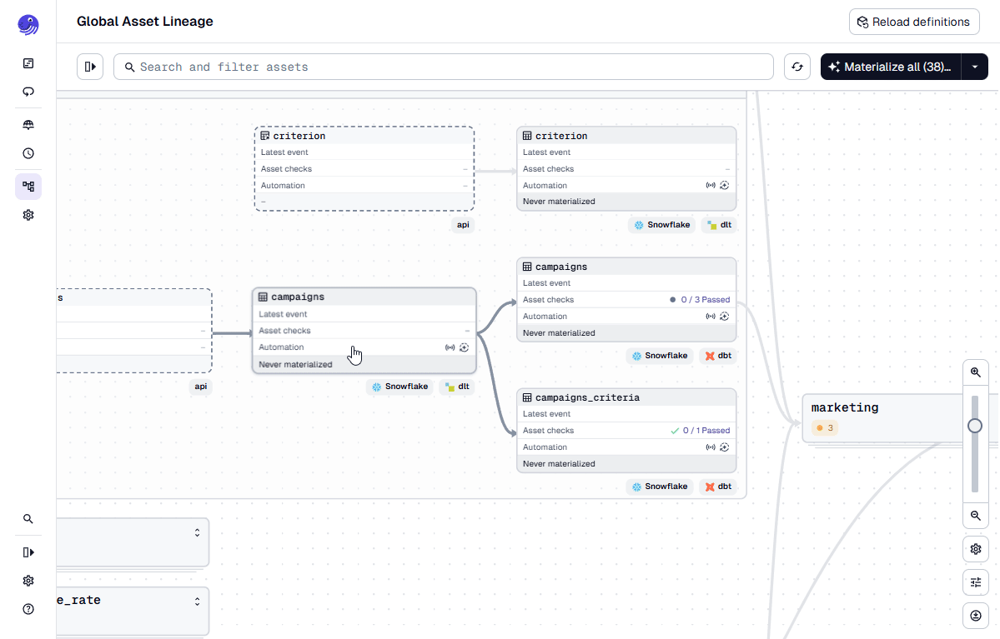
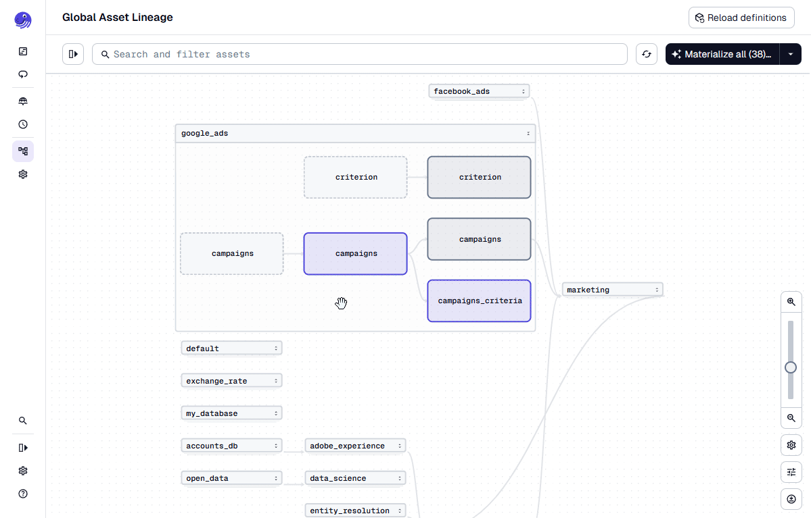

# Quick Start

Follow these steps to explore and run your data pipelines locally using Dagster.

## Launch the Dagster Development Server

From the project root, start the local Dagster UI:
!!! quote

    ```bash
    dagster dev
    ```

This will:

- Spin up a local Dagster instance with your project’s assets, jobs, and schedules.
- Host the Dagster UI at http://localhost:3000
- Watch for file changes and automatically reload definitions.


## Explore the Asset Graph

Once the UI opens, select “Assets” in the sidebar to view the asset graph.

- Hover over assets to see dependencies and upstream/downstream relationships.
- Click any asset to view metadata, schema, and run history.

???+ quote "Asset Graph"
    { align=left }

## Run Materializations

To trigger a run:

1. Click an asset (or select multiple assets in the graph).
2. Click “Materialize” in the top right corner.
3. Monitor progress in real time via the Runs tab.

Each run shows:

- Logs and events (loading data, transforming, writing to Snowflake).
- Output previews for dataframes or Snowflake tables.
- Execution metadata such as duration, version, and success status.

???+ quote "Materialize Assets"
    { align=left }

## Inspect and Debug

- Use the Run Details panel to see per-step logs and resource usage.
- Failed runs can be re-executed with “Retry from failure”.
- The Code Locations tab displays connected modules like sling, dlthub, and dbt.

???+ quote "Inspect Runs"
    { align=left }

## Stopping the Server

When done, stop the dev server by pressing `ctrl` + `c` in the terminal.
Your workspace state (logs, runs, events) is stored in .dagster_home/, allowing you to resume where you left off.