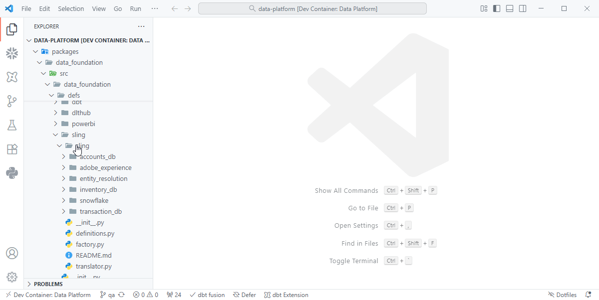
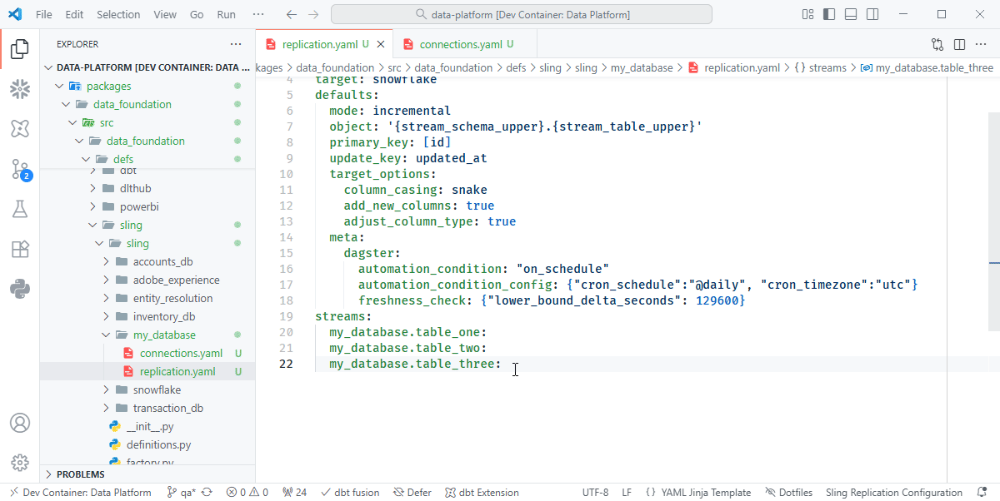
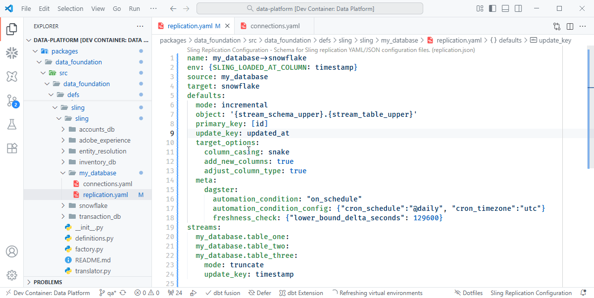

# Sling

## Quick Start

### Create Config Files
Create a folder with the name of the database you are connecting to.
Then create a `connections.yaml` and `replication.yaml` file

???+ quote "Creating Configuration Files"
    { align=left }

### Scaffold connections.yaml
A code-snippet scaffold is available to help setting up a new connection. Press
`ctrl` `space` to open the auto complete pane and select `sling-connections` to populate
the template.
???+ quote "connections.yaml"
    { align=left }

### Scaffold Replication
Press `ctrl` `space` to open the auto complete pane and select `sling-connections` to
create the replication scaffold.

???+ quote "Scaffold replication.yaml"
    { align=left }

### Configure Streams
Press `ctrl` `space` to open intelisense to see valid options for stream configuration.
Streams will inherit settings from the replication defaults if not otherwise set.
???+ quote "Configure Streams"
    { align=left }

### YAML Hints
YAML schemas are enabled to allow for checks for valid inputs, auto-complete, and
descriptions to speed up development time.
???+ quote "Configure Streams"
    { align=left }

## Connections
??? example "connections.yaml"

    [https://docs.slingdata.io/sling-cli/environment](https://docs.slingdata.io/sling-cli/environment#sling-env-file-env.yaml)

    ``` yaml
    connections:
        source_name:
            type: database_type
            database: env.SOURCE__SOURCE__DATABASE
            host: env.SOURCE__SOURCE__HOST
            port: secret.SOURCE__SOURCE__PORT
            user: secret.SOURCE__SOURCE__USER
            password: secret.SOURCE__SOURCE__PASSWORD
    ```

The `connections.yaml` file defines the database, or file system connection details so
that it can be used as a source or desintation in replications.

For values which are stored in the key vault, you can specify the key name, prefixed
with either `env.` or `secret.`.  If you wish for the key to be shown in plain text on
the dagster front end, use `env`, otherwise if it should be securly masked using
`secret.`.

### Variable Prefix
Values prefixed with `env.` will be pulled from the keyvault when dagster starts and 
will be shown in the dagster UI as plain text.  Their values will not change until
the next time the code location is reloaded.

Values prefixed with `secret.` will be pulled from the keyvault at runtime, and their
values will not be shown in the UI.  Their values will be reloaded each time a new
job is run.

## Replication

??? example "replication.yaml"

    [https://docs.slingdata.io/concepts/replication](https://docs.slingdata.io/concepts/replication)
    ``` yaml
    replications:
    - name: source_name->desitnation_name
        env: {SLING_LOADED_AT_COLUMN: timestamp}
        source: source_name
        target: target_name
        defaults:
        mode: incremental
        object: '{stream_schema_upper}.{stream_table_upper}'
        primary_key: ["id"]
        update_key: updated_at
        target_options:
            column_casing: snake
            add_new_columns: true
            adjust_column_type: true
        meta:
            dagster:
            automation_condition: "on_cron_no_deps"
            automation_condition_config: {"cron_schedule":"@daily", "cron_timezone":"utc"}
            freshness_lower_bound_delta: 1800
        streams:
        source_schema.table_one:
            tags: ["contains_pii"]
        source_schema.table_two:
            primary_key: ["pk_column"]
    ```

Replications are how extract and loads are defined.  Source name, and target names
reference connections you have defined in the connections section.  The connection does
not need to be defined in the yaml file you are referencing it in.  Typically there will
be a single yaml file for each connection, with replications showing egress from that
connection to another system.

Streams are the tables, or files to transfer, settings from the default section are
applied to all streams, unless specific configuartion is applied to that stream in which
case the stream config takes precedence.

| Setting  | Purpose |
| -------- | ------- |
| name     | The name of the replication, by convention it should follow `source`->`target`. |
| source   | The source of the data, referenced by connection name. |
| target   | The location where the data will be replicated to, referenced by connection name. |
| defaults | Default values to apply to all streams. |
| streams  | The data asset to load in `schema`.`table` format. |


### Streams
Streams are the tables, or files to transfer. Settings from the default section are
applied to all streams, unless specific configuartion is applied to that stream in which
case the stream config takes precedence.