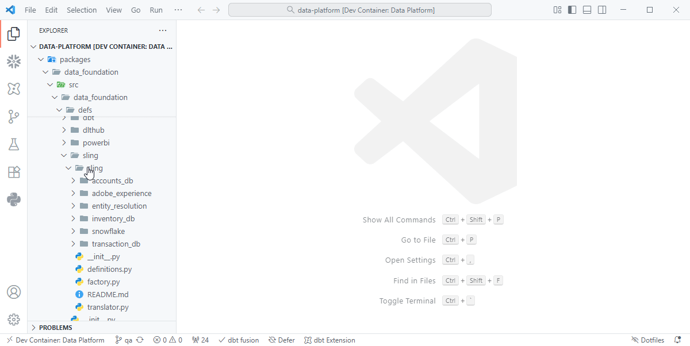
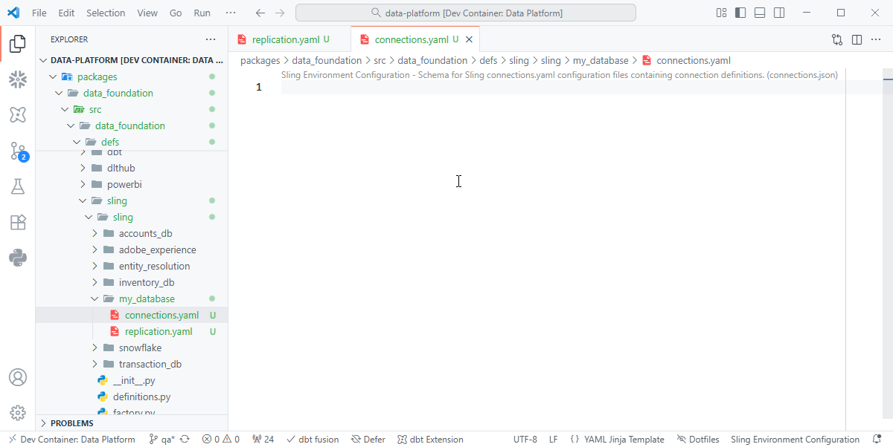
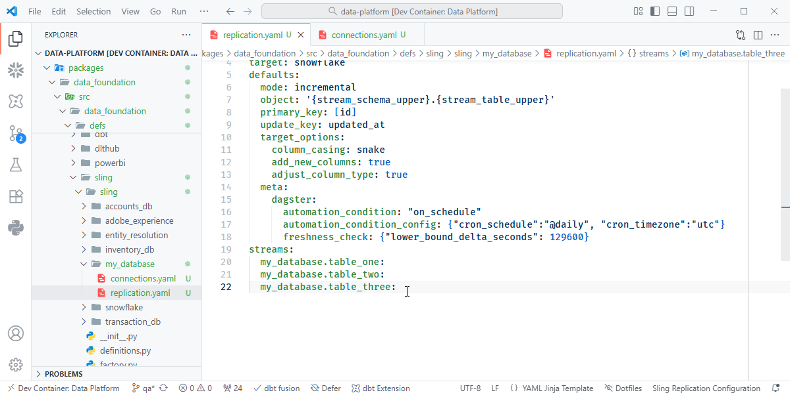
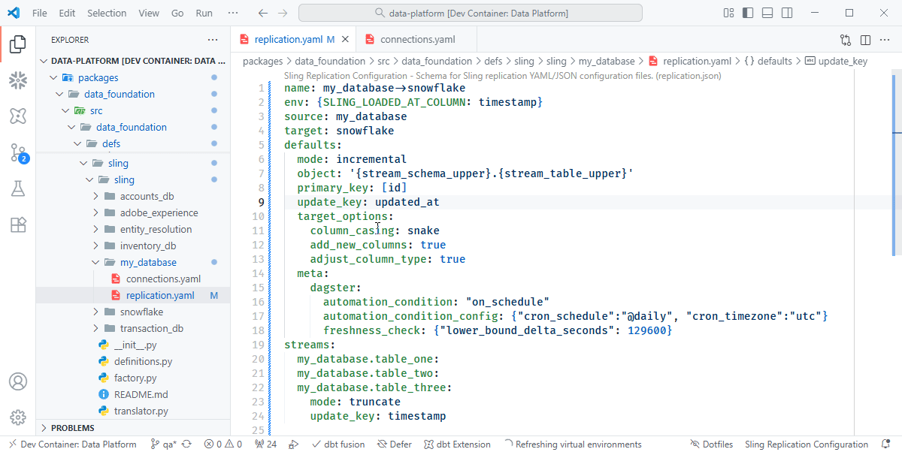

# Quick Start

Follow these steps to quickly set up and run your first Sling configuration.

---

## 1. Create Configuration Files

Create a folder named after the database you’re connecting to.  
Inside that folder, create two files:

- `connections.yaml` — defines connection details  
- `replication.yaml` — defines replication (extract & load) behavior

???+ quote "Creating Configuration Files"
    { align=left }

---

## 2. Scaffold `connections.yaml`

Sling provides IntelliSense scaffolds to simplify setup.  
Press `Ctrl + Space` to open the autocomplete pane and select **`sling-connections`** to populate a connection template.

???+ quote "connections.yaml"
    { align=left }

---

## 4. Configure Streams

Use IntelliSense (`Ctrl` + `Space`) to explore valid stream configuration options.  
Stream-level settings inherit values from the replication defaults unless explicitly overridden.

???+ quote "Configure Streams"
    { align=left }

---

## 5. YAML Hints

YAML schemas are enabled to validate inputs, provide autocomplete, and display field descriptions — all designed to improve accuracy and speed during setup.

???+ quote "YAML Hints"
    { align=left }

---