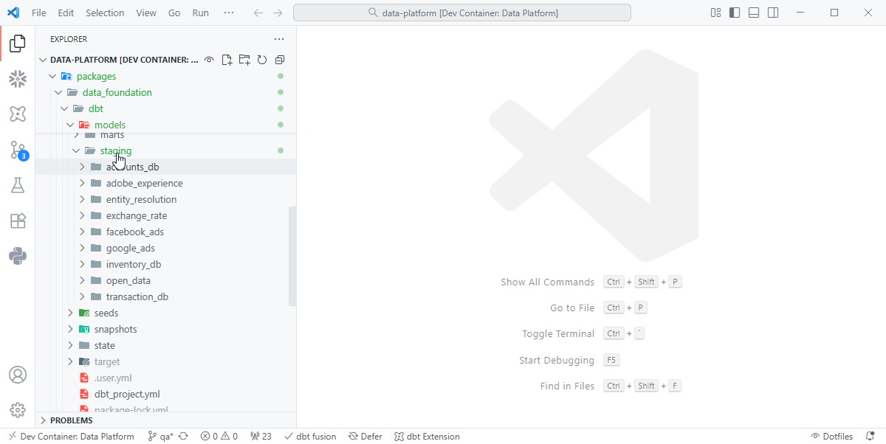
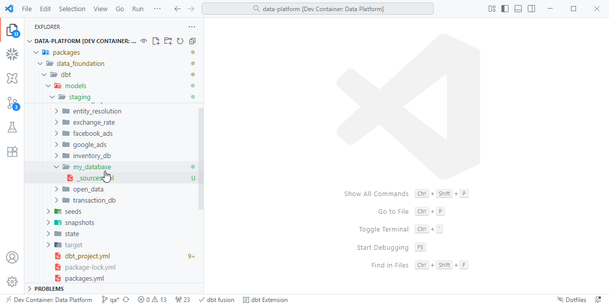
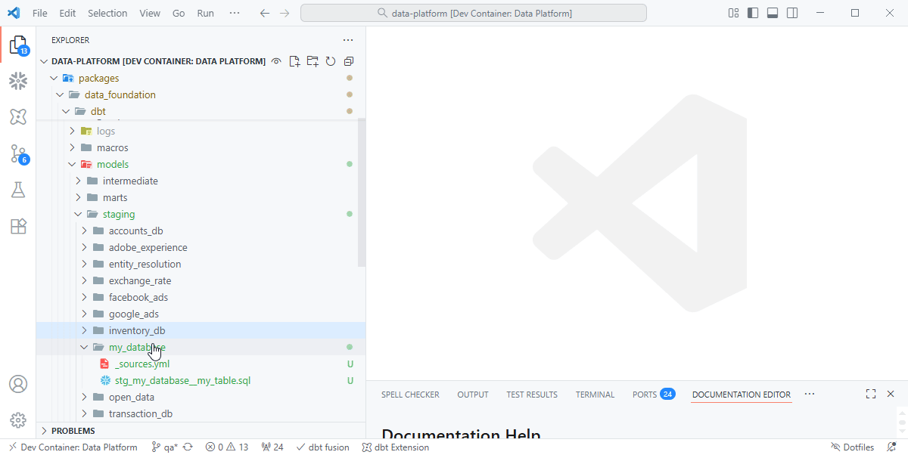
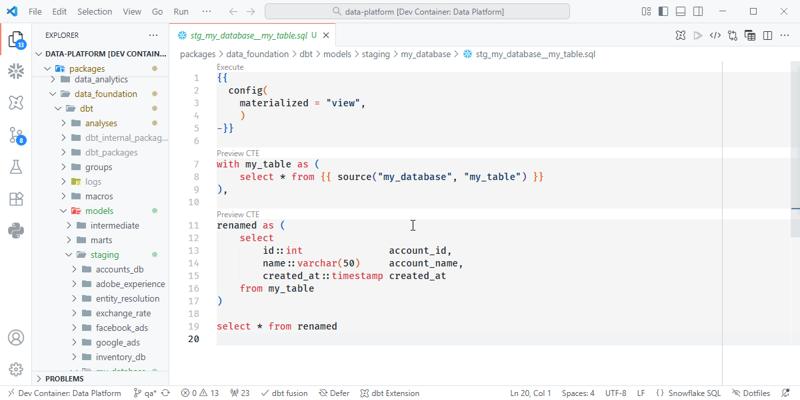

# Quick Start

Follow these steps to quickly set up and run your first dbt configuration.

## Overview

This guide walks through how to extend the existing **dbt project** integrated with **Dagster**.  
All **raw data** from Sling and dltHub is already available in the `raw` database.  
You’ll add new **staging**, **intermediate**, and **mart** models that transform this data for analytics.

---

## 1. Define the Source

Each source system should have a `_sources.yml` file inside its staging folder.  
This declares the raw tables ingested by Sling and dltHub so dbt can reference them with the `source()` function.

???+ quote "Defining Sources"
    { align=left }

??? example "models/staging/accounts_db/_sources.yml"

    ```yaml
    version: 2

    sources:
    - name: my_database
      database: "{{ '_'~target.name~'_' if target.name != 'prod'-}} raw"
      schema: "my_database {{- '__'~target.schema if target.name != 'prod'}}"
      tables:
      - name: my_table
        description: "Data extracted from the source system"

    ```

    !!! tip "Best Practice"
        Each source system should have its own `_sources.yml` file.  
        For example:
        ```
        staging/
        ├── my_database/_sources.yml
        ├── facebook_ads/_sources.yml
        ├── transaction_db/_sources.yml
        ```

---

## 2. Create a Staging Model

Staging models standardize and clean source data from the `raw` schema.  
Each staging folder corresponds to a source system (e.g., `accounts_db`, `facebook_ads`, `transaction_db`).

Navigate to:

```
models/staging/<source_system>/
```

Create a new SQL file named with the convention:  
`stg_<source_system>__<table_name>.sql`

???+ quote "Creating Staging Models"
    { align=left }

??? example "models/staging/my_database/stg_my_database__accounts.sql"

    ```sql
    {{
    config(
        materialized = "view",
        )
    -}}

    with my_table as (
        select * from {{ source("my_database", "my_table") }}
    ),

    renamed as (
        select
            id::int               account_id,
            name::varchar(50)     account_name,
            created_at::timestamp created_at
        from my_table
    )

    select * from renamed
    ```

    !!! tip "Best Practice"
        - Wrap sources in their own one line cte
        - Use all lowercase for readbility
        - Use `snake_case` for column names.  
        - Explicitly cast data types.  
        - Prefix staging models with `stg_` and separate schema and table with double underscores (`__`).

---
## 3. Add dbt and Dagster Jinja Configuration Block
??? example "models/staging/my_database/stg_my_database__accounts.sql"
    ```sql
    {{-
        config(
            schema = "my_database",
            alias = "my_table",
            materialized = "incremental",
            unique_key = "account_id",
            incremental_strategy="delete+insert",
            meta = {
                "dagster": {
                    "automation_condition": "eager",
                    "freshness_check": {"lower_bound_delta_seconds": 129600}
                }
            },
            post_hook = ["{{
                apply_privacy_rules(
                    apply_mask=True,
                    delete_interval="10 years',
                    anonymize_interval="5 years",
                    reference_date_column="updated_at",
                    pii_columns=[
                        "account_name",
                    ]
                )
            }}"]
        )
    -}}
    - ...
    ```

Add the jinja conflig block to the top of the model to define how and when the table is
materialized.
___

## 4. Document and Test Staging Models

Add a companion `.yml` file for each staging model to define metadata and tests.

???+ quote "Model Documentation"
    { align=left }

??? example "models/staging/accounts_db/stg_accounts_db__accounts.yml" 

    ```yaml
    version: 2

    models:
    - name: stg_my_database__my_table
        description: "Standardized data cleaned from raw source"
        columns:
        - name: account_id
            description: "Unique identifier for the account"
            tests:
            - not_null
            - unique
        - name: account_name
            description: "Account display name"
        - name: created_at
            description: "Timestamp when the account was created"
    ```


**Common Tests:**

| Test | Description |
| ---- | ----------- |
| `unique` | Ensures the column contains distinct values. |
| `not_null` | Ensures the column is never null. |
| `relationships` | Validates joins between staging models. |

---

## 5. Create Intermediate Models

Intermediate models combine or enrich staging data before final marts.  
They typically live under `models/intermediate/` and are grouped by business domain (e.g., `marketing`, `finance`, `sales`).

??? example "models/intermediate/marketing/int_marketing__campaign_performance.sql"

    ```sql
    with campaigns as (
        select * from {{ ref('stg_facebook_ads__campaigns') }}
    ),
    performance as (
        select * from {{ ref('stg_facebook_ads__performance') }}
    )

    select
        c.campaign_id,
        c.campaign_name,
        p.impressions,
        p.clicks,
        p.spend
    from campaigns c
    join performance p on c.campaign_id = p.campaign_id
    ```

    !!! tip 
        Use the prefix `int_` to clearly identify intermediate models.  
        They are optional but useful for keeping marts clean and modular.

---

## 6. Create Mart Models

Mart models are the final layer — curated datasets for analytics, reporting, or dashboards.  
They live in `models/marts/` and are organized by domain (e.g., `marketing`, `finance`, `operations`).

??? example "models/marts/marketing/fct_marketing__fct_attributions.sql"

    ```sql
    with campaign_data as (
        select * from {{ ref('int_marketing__campaign_performance') }}
    )

    select
        campaign_id,
        sum(spend) as total_spend,
        sum(clicks) as total_clicks,
        sum(impressions) as total_impressions
    from campaign_data
    group by 1
    ```

**Naming Conventions:**

| Prefix | Zone             | Purpose |
| ------ | ---------------- | ------- |
| `src_` | Raw (Bronze)     |Raw data |
| `stg_` | Staging (Silver) |Raw → Cleaned data |
| `int_` | Staging (Silver) |Intermediate joins and transformations |
| `dim_` | Mart (Gold)      |Dimension tables |
| `fct_` | Mart (Gold)      |Fact tables or aggregated datasets |
| `flt_` | Mart (Gold)      |Flat tables for reporting and ml modeling |

---

## 7. Build and Test

After adding your models they can be materialized and tested in your development
envrionment by running:

```bash
dbt build -s stg_my_database__my_table+
```

Or by using the dbt extension:

???+ quote "Dagster Integration"
    { align=left }

This command runs models, executes tests, and builds dependencies automatically.


---

✅ **Summary**

| Step | Description |
| ---- | ------------ |
| **Sources** | Declare raw tables for use in dbt. |
| **Staging** | Clean and standardize data from the raw schema. |
| **Intermediate** | Join and enrich data across domains. |
| **Marts** | Build curated datasets for analytics. |
| **Build & Test** | Use `dbt build` to validate and materialize models. |

---
